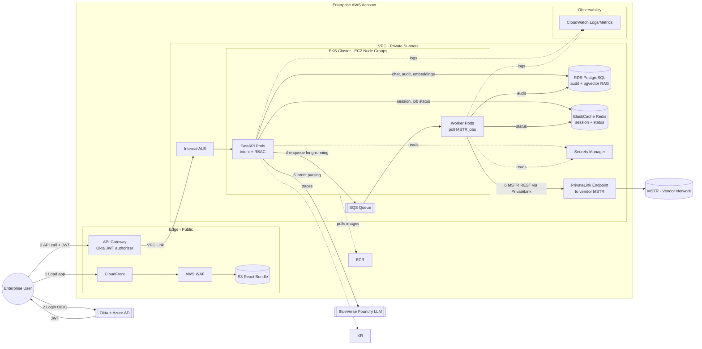

# StrategyAI — AWS Architecture (Revised)

**Target system:** MicroStrategy (MSTR) in vendor network
**Auth:** Okta + Azure AD · **Compute mandate:** EKS only (no Fargate)
**MSTR connectivity:** AWS PrivateLink (already in place between enterprise ↔ vendor)

---

## Diagram A — Icon/Connector View (mermaid `architecture-beta`)

---

## Diagram B — Detailed Flow View (mermaid `flowchart`)

**Legend:** solid = request path · dashed = supporting services (secrets, logs)

---

## End-to-End Flow (one user action)

1. User opens app → CloudFront serves React from S3
2. User logs in via Okta → gets JWT with Azure AD group claims
3. User chats: "refresh cube ABC" → React sends request + JWT to API Gateway
4. API Gateway validates JWT with Okta JWKS → forwards to internal ALB → FastAPI pod
5. FastAPI checks AD groups (RBAC), calls BlueVerse Foundry to parse intent
6. Long-running op → FastAPI drops job on SQS, returns `{job_id}` immediately
7. Worker pod picks up job, calls MSTR REST via **PrivateLink endpoint** → vendor MSTR
8. Worker writes status to Redis (live) + Postgres (audit with real user ID)
9. React polls `/jobs/{id}` → reads Redis → updates UI

---

## AWS Services — Why Picked

| # | Service | Purpose | Why it's the best fit |
|---|---|---|---|
| 1 | **Route 53** | DNS | Native AWS, integrates with ACM + CloudFront |
| 2 | **CloudFront** | CDN for React SPA | Edge caching, DDoS shield, WAF attach point |
| 3 | **S3** | React static hosting + PDF/report artifacts | Cheapest object store, native CloudFront origin |
| 4 | **AWS WAF** | OWASP rules, rate limiting | AWS-native, attaches to CloudFront + API Gateway |
| 5 | **ACM** | Free TLS certs, auto-renew | No manual cert rotation |
| 6 | **API Gateway (HTTP API)** | Public entry + Okta JWT validation + throttling | Validates Okta tokens with zero app code |
| 7 | **Internal ALB** | Routes API GW → EKS | L7 routing, health checks, EKS ingress-friendly |
| 8 | **EKS** (EC2 node groups) | Container orchestration | Client mandate — Fargate not allowed in client AWS account |
| 9 | **ECR** | Private container registry | VPC-native, IAM-scoped, no Docker Hub limits |
| 10 | **SQS** | Decouple API from long MSTR polls | Managed, cheap, fits job-queue pattern |
| 11 | **RDS PostgreSQL** | Audit log, chat history, pgvector RAG | Standard Postgres, cheaper than Aurora |
| 12 | **ElastiCache Redis** | Session cache + live job status | Sub-ms reads; DB is not a cache |
| 13 | **Secrets Manager** | MSTR, DB, Okta creds | Auto-rotation, IAM-scoped per pod (IRSA) |
| 14 | **KMS** | Encryption keys at rest | Customer-managed keys for compliance |
| 15 | **VPC + NAT Gateway** | Network isolation + egress | Required for private workloads |
| 16 | **PrivateLink Endpoint** | Enterprise ↔ vendor MSTR | Already in place; no public MSTR exposure |
| 17 | **CloudWatch** | Logs, metrics, alarms | Native, cheap, zero setup for EKS/ALB/API GW |
| 19 | **IAM + IRSA** | Pod-level AWS permissions | Least privilege per pod |

---

## External (not AWS)

| System | Role |
|---|---|
| **Okta** | Identity provider — OIDC login, issues JWT |
| **Azure AD** | Group source, federated into Okta |
| **BlueVerse Foundry** | External LLM for NLP intent parsing |
| **MSTR** | Target system in vendor network |
